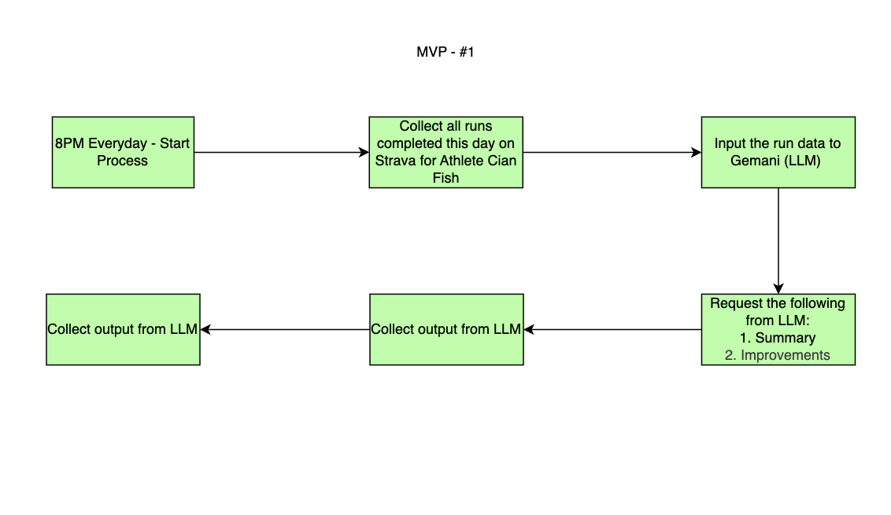

# Strava
This is a repository that takes latest runs from Strava, gets AI insights and sends it to the user. 

# Current Process
The current process of this program is to run at 8PM BST each day. It will look for any runs completed by the specific athlete. If no runs were completed that day, the program will stop. If a run was logged by the athlete on Strava, it will start the process. 

The program will send the run data to Gemini (LLM), get a summary of the run and areas to improve on. 

Once the LLM returns the output data, the program will send the summary to the user. Currently Webex is supported. 

# Future Plans
There are multiple different avenues this project will take in the future. 

The first plan is to collect runs from Strava via webhooks rather than running at 8pm everyday. This will prevent the need for the program to run every day even when there is no runs complete and instead will only run the program when a run has been complete on Strava.

The second plan is to collect gym data. This will collect all the reps and sets the user logs from the gym to recieve a more accurate idea of the athlete. 

The third plan is to collect weight data from a smart weighing scales. This will collect the athletes weight which can be used to keep track of the user. 

The fourth plan is to be granted access to the Garmin API which can allow us to retrieve even more data from the athlete such as steps, heart rate, sleep and recovery. 